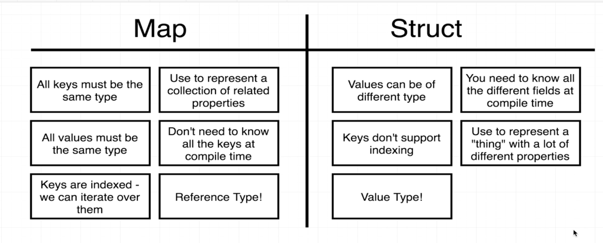
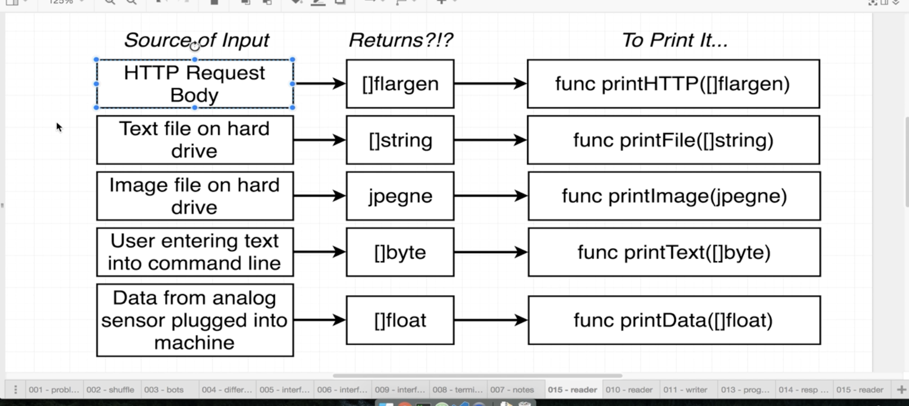
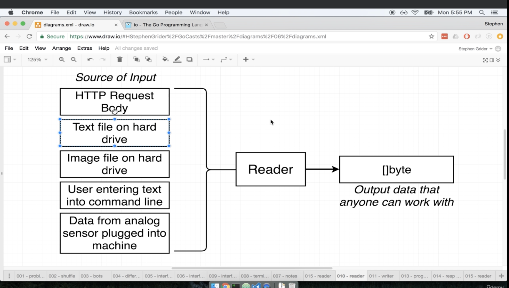
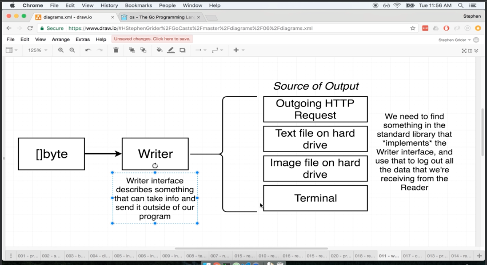
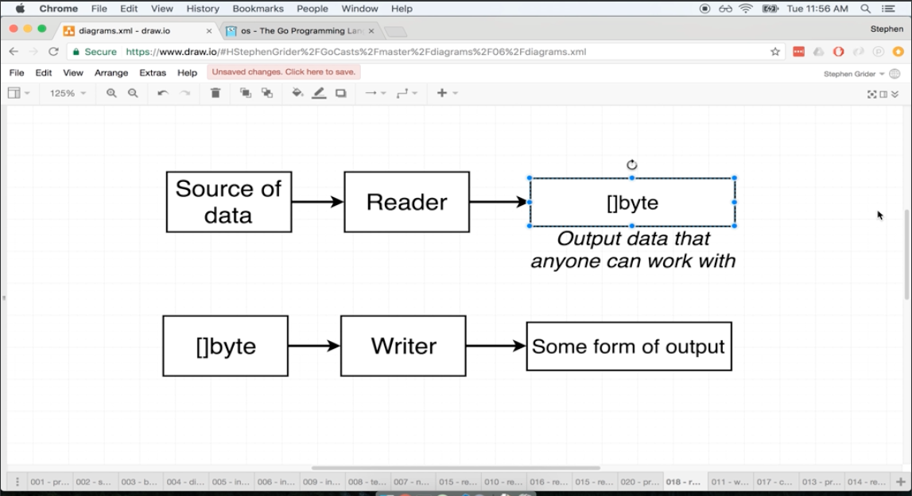
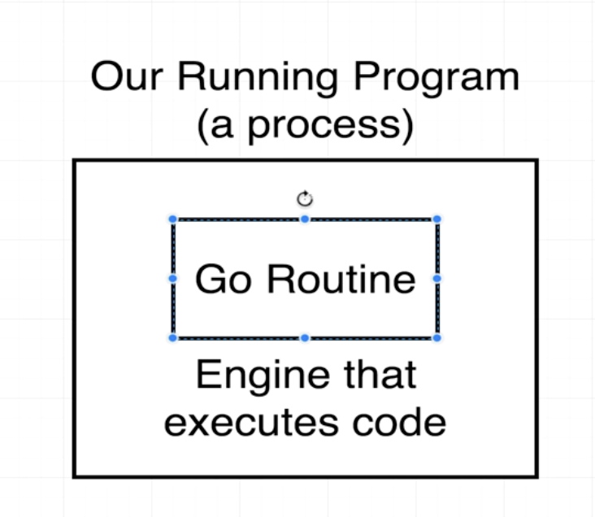
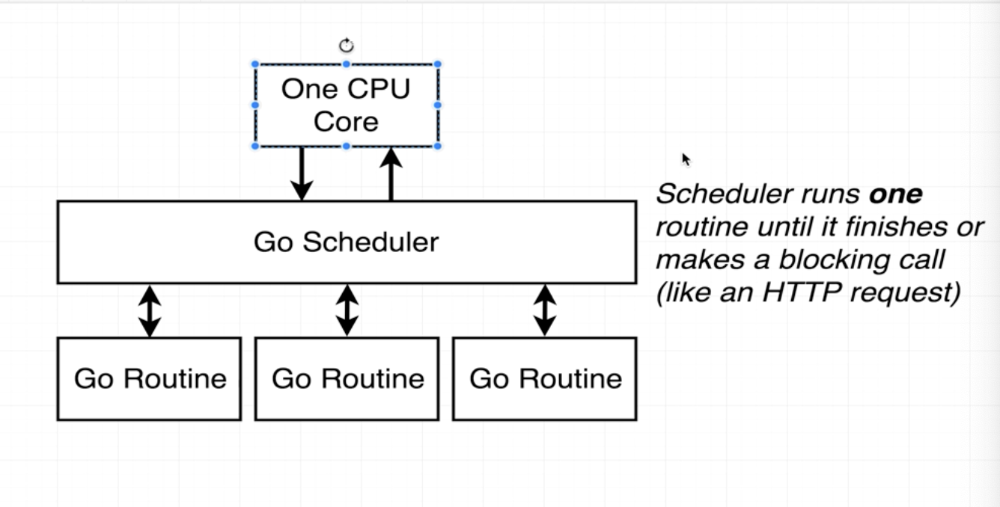
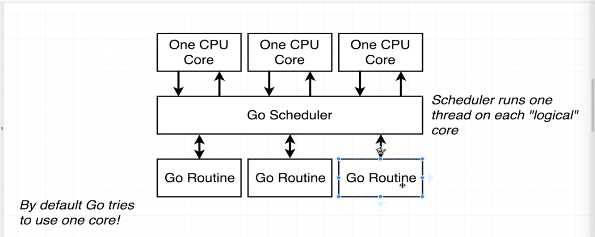
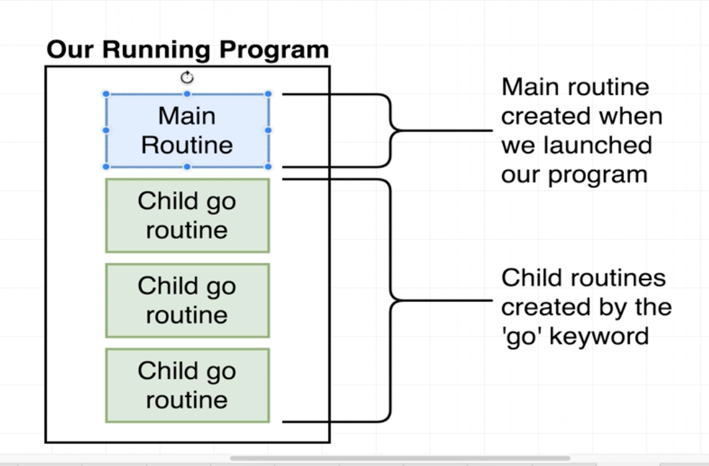
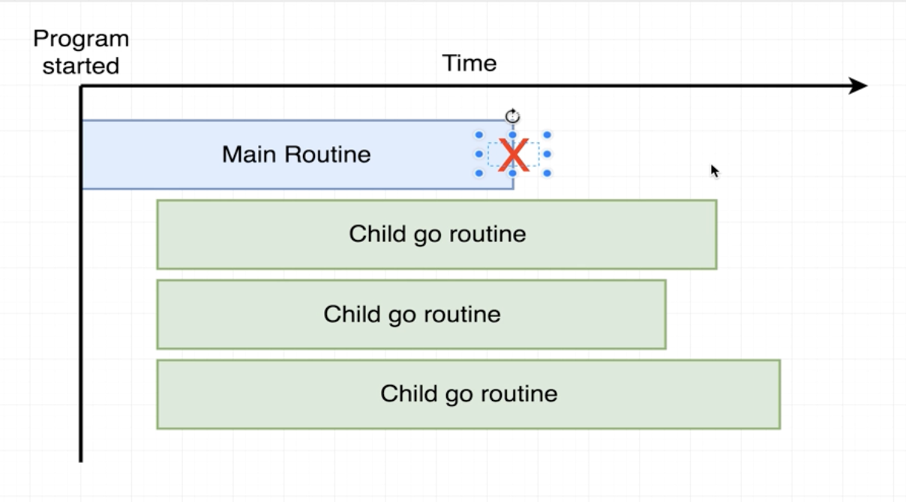

# Go - The Complete Developer's Guide (Golang, udemy)

1. Go
- Statically typed language - we have to specify data type while assigning variable. Although, it can be inferred from the right hand side value. 
- Dynamically typed (JavaScript, Python, etc)
- Declaration of varibles:
    1. var card string = "Ace of Spades"
	2. card := "Ace of Spades" - > Relying on Go compiler, we only use := syntax for a brand new variable, else card = "test" for reassignment
- Array: Fixed list of things
- Slice: An array that can grow or shrink

2. OO Approach vs Go Approach
- Go is not OO
- Separate files and custom datatypes
- Receiver function: sets up methods on variables.
    1. d = actual copy of the deck (object). By convention, this has to be one/two lettered abbreviation which matches the type but not mandatory
    2. deck = every variable of type deck (class)

3. Slice
- slice_value[startIndexIncluding: endIndexExcluding]
- slice_value[:2] or slice_value[3:]
- A slice has 3 attributes internally: ptr to head(head of the array), capacity and length

4. Type Conversion in Go:
- String to byte size: []byte("Hi there") = convert "Hi there" to slice of byte

5. Pointers:
- Go is pass by value language - Go will copy the value of parameter variable and store it in a new variable
- jimPointer := &jim - & - give access to memory address of jim
- variableName *type - this is a type description: It means we are working with a pointer to a person
- *variableName - give value in this memory address. This is an operator - It means we want to manipulate the value pointer is referencing
- *** Whenever you pass an integer, float, string, or struct into a function, it is pass by value but not applcable for slice ***

6. Gotchas with pointers
- In struct you need pointers but in a slice, you do not because slice has 3 attributes internally: ptr to head(head of the array), capacity and length. So when value of the slice is copied(pass by value), the pointer is copied as well.
- DS that behave like slices: maps, channels, pointers, functions
- DS who don't: int, float, string, bool, structs

7. Map:
- All Keys and all Values should be of same type

8. Struct vs Map:

9. Interfaces:
- Problems that interfaces solve:
    * Reuse code (functions) for different datatypes
    * Go does not support function overloading by default. Without interfaces we have to handle different types individually. 
- Datatypes are of two type:
    * Concrete type: map, struct, int, string - types the give values
    * Interface type:
- Interfaces are not generic types
- They are "implicit": We don't have to specify the relation between interface and other types e.g. "englishBot implements bot". Only downside: difficult to keep track of hierarchy
- Interfaces are a contract that help us manage types
- Datatypes can be an interface. For e.g.
    a. type Response struct {
        Status string,
        Body io.ReadCloser,
    }
    b. In a. ReadCloser is an interface and Reader and Closer are interfaces as well and not a function. This implies we can have a loop of interfaces 
    type ReadCloser struct {
        Reader,
        Closer,
    }
    c. Reader Interface helps handle different sources of input. . It requires you to implement Reader interface and it contains Read function that outputs []byte. Reader interface gives common point of contact for all data types.  
    d. Write interface = condensed form of Reader. 
    e. Difference between Writer and Reader: . To satisfy writer interface, the type should implement function write.
    e. io.Copy function: Take information from source and copy to destination. Source has to be something that implements Reader interface and destination should implement Reader interface
    
10. Go Routines:
- Used for concurrency
- When we launch a go program we automatically create 1 Go routine. Go routine executes each line of code 1 by 1. 
- Go scheduler monitors the code inside each go routine. By default, go attempts to use only 1 cpu core  
- Go scheduler can be configured to use multicore. Although, concurrency is not parallelism. Program is concurrent if it has ability to load up multiple threads for 1 program. It does not necessarily mean that they are running parallel. Parallelism needs multiple cores

- Go routines: Main and child routines

11. Channels:
- Main routine does not wait for the children routines to finish.

Hence, we need channels to communicate between the routines. 
- Channels is like text messaging. They are typed

12. Function literals:
- Same as lambda in Java, python etc 